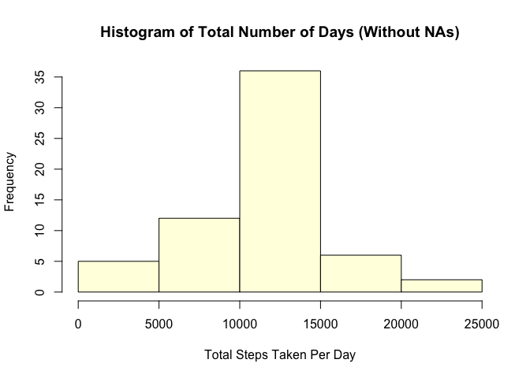
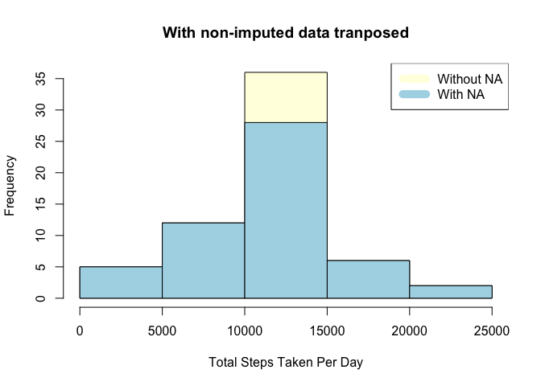

# Reproducible Research: Peer Assessment 1
Abhee Brahmnalkar  
July 17, 2015  


## Loading and preprocessing the data


```r
setwd("/Users/abheebrahmnalkar/Desktop/datasciencecoursera/RR")
if(!file.exists("./RR-P1")){dir.create("./RR-P1")
         fileUrl <- "https://d396qusza40orc.cloudfront.net/repdata%2Fdata%2Factivity.zip"
         download.file(fileUrl, destfile = "./RR-P1/Dataset.zip", method = "curl")
         unzip(zipfile="./RR-P1/Dataset.zip",exdir="./RR-P1")
         setwd("/Users/abheebrahmnalkar/Desktop/datasciencecoursera/RR/RR-P1")
         file.remove("Dataset.zip")
         print("Created directory, downloaded and unzipped files")
}

if(file.exists("./RR-P1")) {
    setwd("/Users/abheebrahmnalkar/Desktop/datasciencecoursera/RR/RR-P1")
    if(!file.exists("activity.csv")) {
        fileUrl <- "https://d396qusza40orc.cloudfront.net/repdata%2Fdata%2Factivity.zip"
        download.file(fileUrl, destfile = "./Dataset.zip", method = "curl")
        unzip(zipfile="./Dataset.zip",exdir="./")
        file.remove("Dataset.zip")
        print("File had to be downloaded again")
    }
}

# Read the file if it's not already read
if(!exists("NEI")){
    activity <-read.csv("activity.csv")
}

library(plyr)
steps_by_day <- ddply(activity, .(date), function(x) sum(x$steps))
steps_by_day$V1 <- as.numeric(steps_by_day$V1)
```


## What is mean total number of steps taken per day?

```r
hist(steps_by_day$V1, xlab = "Total Steps Taken Per Day", ylab = "Frequency", main = "Histogram of Total Number of Steps Per Day", col = "light blue")
```

 

```r
old_steps_by_day <- steps_by_day

sprintf("Average Steps: %s", mean(na.omit(steps_by_day$V1)))
```

```
## [1] "Average Steps: 10766.1886792453"
```

```r
sprintf("Median Steps: %s", median(na.omit(steps_by_day$V1)))
```

```
## [1] "Median Steps: 10765"
```
## What is the average daily activity pattern?

```r
steps_by_interval <- ddply(activity, .(interval), function(x) mean(na.omit(x$steps)))
plot(steps_by_interval$interval, steps_by_interval$V1, type = "l", xlab = "Interval", ylab = "Average Steps Taken")
```

 


## Imputing missing values

```r
# Counting total missing values

sprintf("Total number of missing values in the dataset: %s" , sum(is.na(activity$steps)))
```

```
## [1] "Total number of missing values in the dataset: 2304"
```

```r
# loop to replace missing values
for (i in 1:length(activity$steps)) {
    if(is.na(activity$steps[i])) {
    read_interval <- activity$interval[i]
    activity$steps[i] <- steps_by_interval$V1[steps_by_interval$interval == read_interval]
    }
}

# Repeating earlier code to reproduce results and see if anything changed since we took care of missing values.  Let's change the plot label though!

steps_by_day <- ddply(activity, .(date), function(x) sum(x$steps))
steps_by_day$V1 <- as.numeric(steps_by_day$V1)
#par(mfrow = c(1, 2), mar = c(12, 4, 3, 2), mgp = c(3, 1, 0), cex = 0.8)
hist(steps_by_day$V1, xlab = "Total Steps Taken Per Day", ylab = "Frequency", main = paste("Histogram of Total Number of Days (Without NAs)"), col = "light yellow")
```

 

```r
hist(steps_by_day$V1, xlab = "Total Steps Taken Per Day", ylab = "Frequency", main = paste("With non-imputed data tranposed"), col = "light yellow")
hist(old_steps_by_day$V1, xlab = "Total Steps Taken Per Day", ylab = "Frequency", main = paste("With non-imputed data transposed"), col = "light blue", add = T)

legend("topright", c("Without NA", "With NA"), col = c("light yellow", "light blue"), lwd = 10)
```

 

```r
sprintf("Average Steps without NAs: %s", mean(na.omit(steps_by_day$V1)))
```

```
## [1] "Average Steps without NAs: 10766.1886792453"
```

```r
sprintf("Median Steps without NAs: %s", median(na.omit(steps_by_day$V1)))
```

```
## [1] "Median Steps without NAs: 10766.1886792453"
```
## Are there differences in activity patterns between weekdays and weekends?

```r
# Adding day column to the activity dataset and forcing date column to date form using as.Date

activity$date <- as.Date(activity$date)
# filling in day values and converting it to Factor
activity$day <- weekdays(activity$date)
activity$day <- as.factor(activity$day)

# adding weekday vs weekend
activity$daytype <- ifelse(activity$day %in% c("Saturday", "Sunday"), "Weekend", "Weekday")
activity$daytype <- as.factor(activity$daytype)

# Splitting dataset into two data frames, one for weekday and another for weekend

activity_weekday <- activity[activity$daytype == "Weekday", ]
activity_weekend <- activity[activity$daytype == "Weekend", ]

# Plotting Steps by interval for Weekdays and Weekends

weekday_steps_by_interval <- ddply(activity_weekday, .(interval), function(x) mean(na.omit(x$steps)))
weekend_steps_by_interval <- ddply(activity_weekend, .(interval), function(x) mean(na.omit(x$steps)))

par(mfrow = c(1, 2), mar = c(12, 4, 3, 2), mgp = c(3, 1, 0), cex = 0.8)
plot(weekday_steps_by_interval$interval, weekday_steps_by_interval$V1, type = "l", xlab = "Interval", ylab = "Average Steps Taken", col = "light blue", main = "Weekdays")
plot(weekend_steps_by_interval$interval, weekend_steps_by_interval$V1, type = "l", xlab = "Interval", ylab = "", col = "orange", main = "Weekends")
```

 
